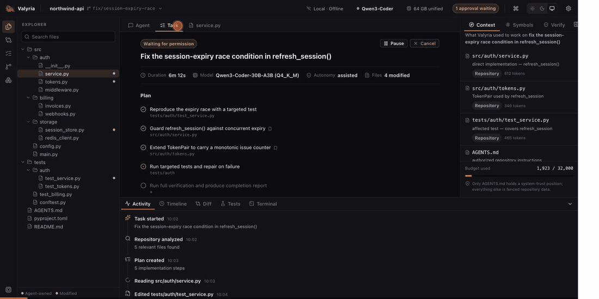

<p align="center">
  
</p>

<h1 align="center">Valyria App</h1>

<p align="center">
  The desktop application for <a href="../valyria">Valyria</a> — a local-first
  autonomous coding harness that runs entirely on your own machine.
</p>

## See it



<p align="center">
  
</p>

The tour above runs against `apps/desktop/src/data/mock.ts` — every panel is
built on the exact data shapes Core's protocol will provide.

> **Status: mid-pivot.** valyria-app is being rebuilt as a **branded Code-OSS
> distribution** (a full VS Code-class editor) with the Valyria agent shipped as
> a **bundled built-in extension**. See
> [docs/ARCHITECTURE-VSCODE.md](docs/ARCHITECTURE-VSCODE.md) for the new shape
> and the migration phases.
>
> - `vscode/` — Code-OSS submodule, pinned by `build/VSCODE_REF`
> - `build/` — the branding overlay applied by `scripts/bootstrap.sh`
> - `extension/` — the Valyria built-in extension (TypeScript)
> - `crates/valyria-bridge-host/` — stdio JSON-RPC front end for `valyria-bridge`
> - `apps/desktop/` — the old Tauri prototype, retired once the extension is at parity
>
> Get going: `brew install node@24` (one-time; keg-only) →
> `scripts/bootstrap.sh` → `scripts/install-deps.sh` → `scripts/dev.sh`.
> Phase 0 is complete — that sequence launches a branded **Valyria** window
> with the agent extension active. See
> [docs/IMPLEMENTATION-PLAN.md](docs/IMPLEMENTATION-PLAN.md).
>
> The visual prototype under [apps/desktop](apps/desktop) still builds
> (`npm run app:dev`) and its panels are the reference for the extension's
> agent surfaces.

`valyria-app` is a **client** of the Valyria Core runtime, not a second
implementation of it. Core plans, edits, runs and verifies; the app is the
window onto that work — repository, task, context, actions, verification — and
the place a developer approves what the agent is allowed to do.

## Documents

| Document | What it covers |
|---|---|
| [docs/ARCHITECTURE-VSCODE.md](docs/ARCHITECTURE-VSCODE.md) | **Current.** The Code-OSS-fork architecture, repo topology, process model, branding checklist |
| [docs/IMPLEMENTATION-PLAN.md](docs/IMPLEMENTATION-PLAN.md) | **Current.** The phase-by-phase build plan (0–11), standing gates, dependency graph, capability-gap → phase map |
| [docs/PLAN.md](docs/PLAN.md) | The original Tauri build plan. Still accurate about Core, the protocol, and the design decisions (D1–D14); superseded on the app-shell architecture by ARCHITECTURE-VSCODE.md |
| [docs/CORE-INTERFACE.md](docs/CORE-INTERFACE.md) | What Core's frozen v1 protocol offers, the twelve gaps between it and the product, and the additive methods the app needs |

Start with the design decisions in PLAN §1 and the gap list in CORE-INTERFACE §2
— between them they explain nearly every structural choice in the plan.

## The shape of it

```text
┌──────────────────────────────┐        ┌────────────────────────────┐
│ valyria-app (Tauri)          │        │ valyria serve (Core)       │
│                              │        │                            │
│  renderer  ── React/TS       │  NDJSON│  one runtime per workspace │
│  bridge    ── Rust           │◄──────►│  agent loop, tools, index, │
│              protocol client │  Unix  │  verification, ledger      │
│              supervisor, PTY │  socket│                            │
└──────────────────────────────┘        └────────────────────────────┘
        UI process may die              runtime survives independently
```

Core runs as a supervised sidecar daemon, never inside the UI process, so a
crashed window never kills a running task.

## License

Apache-2.0. See [LICENSE](LICENSE).
