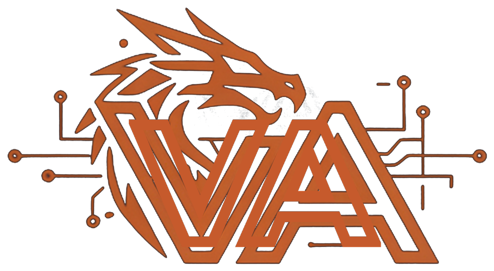
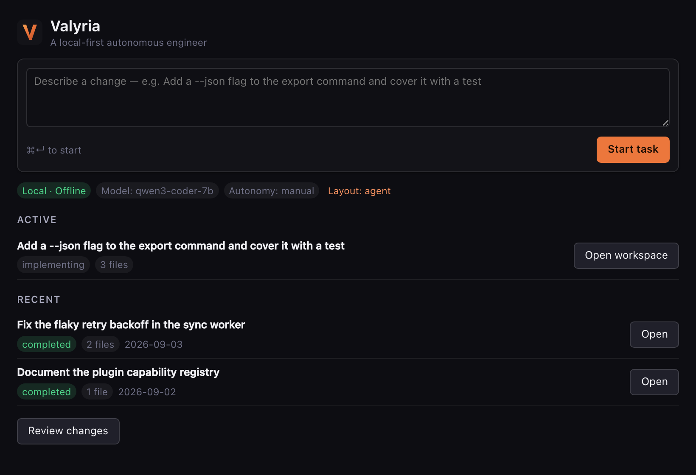
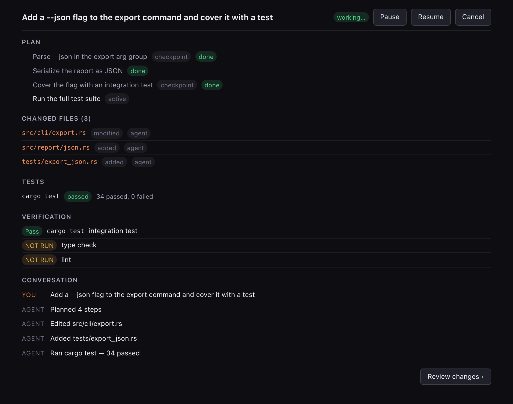
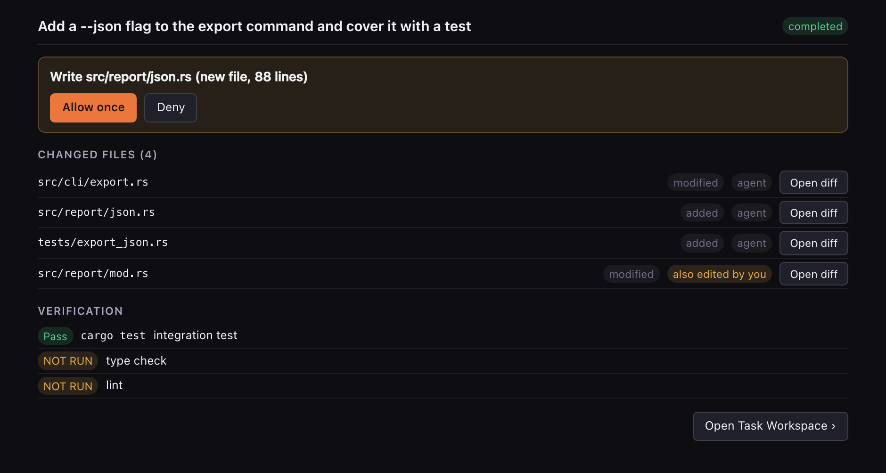
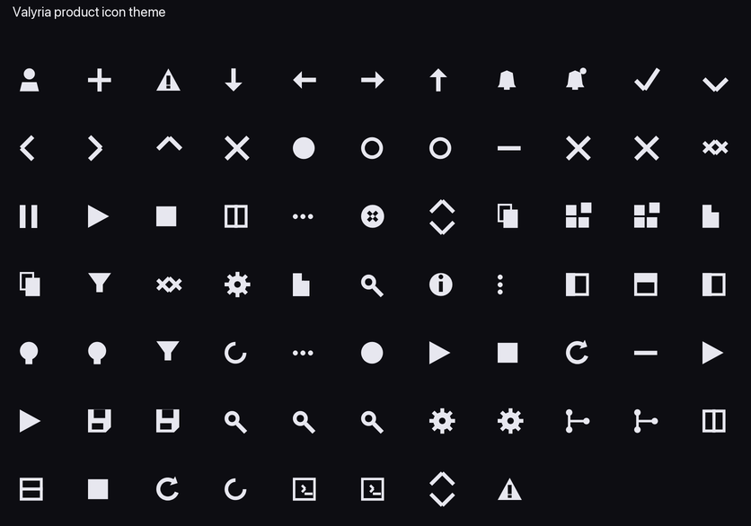

<p align="center">
  
</p>

<h1 align="center">Valyria App</h1>

A branded [Code - OSS](https://github.com/microsoft/vscode) distribution that
ships the [Valyria](../valyria) coding agent as a built-in extension. The editor
is upstream Code - OSS, untouched; the agent is a client of the Valyria Core
runtime, which runs as a supervised local daemon — one per workspace, outside the
editor process — so a crashed window never kills a running task.

## Status

Pre-release. `scripts/dev.sh` builds and launches the branded window with the
agent active. Running a live agent task needs a `valyria` Core binary (see
[Quickstart](#quickstart)). Signed installers are not yet published.

## It doesn't feel like a VS Code fork

The editor is upstream, but the shell is Valyria's — within the extension API and
`configurationDefaults`, **no editor patches**
([docs/UX-DIFFERENTIATION.md](docs/UX-DIFFERENTIATION.md)):

| | |
|---|---|
|  | **Home** replaces the Welcome page — a task prompt, active + recent tasks, the `Local · Offline · Model` marker, the layout switch. |
|  | **Task Workspace** — the focused task as one document: conversation, plan, changed files (with Core's ledger ownership), tests, and verification where a category with no evidence reads `NOT RUN`. |
|  | **Review Changes** — agent-authored edits framed for approval; each row opens the editor's own diff. Ownership (`agent` / `also edited by you`) comes from Core, never inferred. |

- **Dual-mode layout** — a per-workspace switch (`⌘K ⌘L`) between an **agent**
  layout (activity bar hidden, single tabs, Home at the centre) and a familiar
  **editor** layout. Ships `editor`; nothing is locked.
- **Status-bar agent ticker** — `Planning` → `Running cargo test` →
  `Editing 3 files` → `Blocked: approval` → `Task done`, live off the event stream.
- **Product icon theme** — the workbench codicons replaced by a solid geometric
  Valyria family. File-type icons stay stock (Seti); folders are Valyria's.

<p align="center"></p>

## Layout

| Path | Contents |
|---|---|
| `vscode/` | Code - OSS submodule, pinned by `build/VSCODE_REF`; branded by `scripts/bootstrap.sh`, never edited in place |
| `build/` | Branding overlay and patches |
| `extension/` | The Valyria built-in extension — the agent UI, the dual-mode layout, the editor-area surfaces |
| `theme/`, `chrome/` | Code-free built-ins: the Valyria colour themes; the product icon theme, a file icon theme (Seti files + Valyria folders), and the chrome defaults |
| `crates/valyria-bridge/` | The only code that speaks Core's protocol: transport client, session supervisor, event pump |
| `crates/valyria-bridge-host/` | stdio JSON-RPC front end the extension spawns |
| `packages/protocol`, `packages/state` | Generated wire types and decoders; the pure event reducer |
| `core.lock.json` | Pinned Core revision and protocol version the bridge builds against |

## Requirements

- Node `24` — `brew install node@24` on macOS; `scripts/node-guard.sh` locates it
- Rust, version pinned in `rust-toolchain.toml`
- Python 3 with Pillow (branding icons) — fontTools is optional (product-icon regen; `chrome/dist/` is committed)
- Linux or macOS

## Quickstart

```bash
scripts/bootstrap.sh       # submodule + branding overlay + patches + workbench icons
scripts/install-deps.sh    # Code - OSS and extension dependencies (~1 GB, one-time)
scripts/dev.sh             # build valyria-bridge-host, watch the extension, launch the window
```

Then, in the launched window:

1. **Open a repository** — `Valyria: Open Repository for the Agent` (opening a
   folder *is* the authorization; the agent only reads and writes inside it).
2. **Pick a layout** — first-run offers Agent vs Editor; switch any time from the
   status bar or `⌘K ⌘L`.
3. **Start a task** — `⌘I`, or type in **Home** (`⌘K ⌘H`). The plan, edits,
   commands, tests and verification stream into the **Task Workspace**;
   `⌘K ⌘R` opens **Review Changes**.

### Core binary

`dev.sh` builds `valyria-bridge-host` into `extension/bin/`; the extension spawns
it, and it supervises a `valyria serve` daemon per workspace. It uses the bundled
Core sidecar by default. To use a local Core build instead:

```bash
VALYRIA_BIN=/path/to/valyria/target/debug/valyria scripts/dev.sh
```

or set `valyria.core.binaryPath` in the launched window's settings.

### Regenerating assets

```bash
python3 chrome/tools/build_icons.py    # product icon WOFF + themes  -> chrome/dist/
node scripts/gen-screenshots.mjs       # the README surface screenshots -> docs/assets/
```

## Architecture

```
┌─ Valyria (Electron / branded Code-OSS) ──────┐     ┌─ valyria serve (Core) ─────┐
│  workbench + editor  ── upstream, untouched   │     │                            │
│  ext host (Node)                              │     │  one daemon per workspace  │
│    └─ extension "valyria"                     │     │  agent loop, tools, index, │
│         child_process ─ valyria-bridge-host ──┼─────►  verification, ledger      │
│              (stdio JSON-RPC)   socket / pipe │     │                            │
└──────────────────────────────────────────────┘     └────────────────────────────┘
```

The extension owns no socket — the Core connection lives entirely inside
`valyria-bridge-host` — and reaches the editor only as an extension. Files,
search, diff, git, terminal, and debug are upstream Code - OSS.

Full detail in [docs/ARCHITECTURE-VSCODE.md](docs/ARCHITECTURE-VSCODE.md).

## Documentation

| Document | Contents |
|---|---|
| [docs/ARCHITECTURE-VSCODE.md](docs/ARCHITECTURE-VSCODE.md) | Repo topology, process model, branding |
| [docs/UX-DIFFERENTIATION.md](docs/UX-DIFFERENTIATION.md) | The Valyria UX/editor identity: icons, chrome defaults, dual-mode layout, agent-as-editor surfaces |
| [docs/INTEGRATION.md](docs/INTEGRATION.md) | How Core is pinned and consumed; the first-run model |
| [docs/CORE-INTERFACE.md](docs/CORE-INTERFACE.md) | The Core protocol surface the app relies on |
| [docs/PACKAGING.md](docs/PACKAGING.md), [docs/RELEASING.md](docs/RELEASING.md) | Building and shipping signed installers |
| [docs/SECURITY-REVIEW.md](docs/SECURITY-REVIEW.md) | Process boundary, webview CSP, trust model |

## License

Apache-2.0. See [LICENSE](LICENSE).
