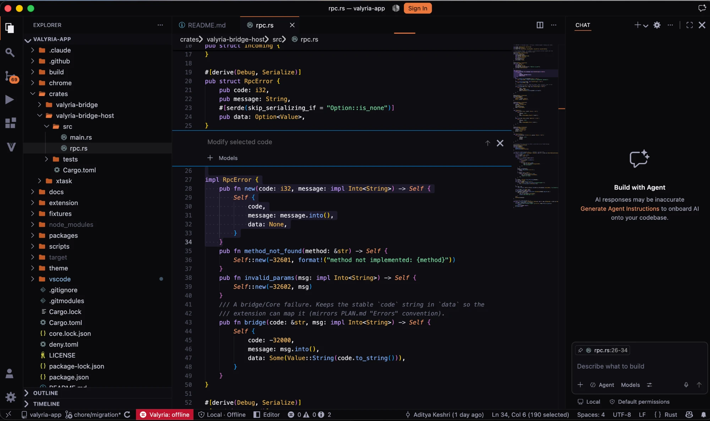

<p align="center">
  
</p>

<h1 align="center">Valyria App</h1>

A branded [Code - OSS](https://github.com/microsoft/vscode) distribution that
ships the [Valyria](../valyria) coding agent as a built-in extension. The editor
is upstream Code - OSS; the agent is a client of the Valyria Core runtime, which
runs as a supervised local daemon — one per workspace, outside the editor
process — so a crashed window never kills a running task.

## Status

Pre-release. `scripts/dev.sh` builds and launches the branded window with the
agent active. Running a live agent task needs a `valyria` Core binary (see
[Quickstart](#quickstart)). Signed installers are not yet published.

## Requirements

- Node `24` — `brew install node@24` on macOS; `scripts/node-guard.sh` locates it
- Rust, version pinned in `rust-toolchain.toml`
- Python 3 with Pillow (branding icons); fontTools is optional (`chrome/dist/` is committed)
- Linux or macOS

## Quickstart

```bash
scripts/bootstrap.sh       # submodule + branding overlay + patches + icons
scripts/install-deps.sh    # Code - OSS and extension dependencies (~1 GB, one-time)
scripts/dev.sh             # build valyria-bridge-host, watch the extension, launch the window
```

In the launched window:

1. **Open a repository** — `Valyria: Open Repository for the Agent`. Opening a
   folder is the authorization; the agent only reads and writes inside it.
2. **Start a task** — `⌘I`, or the Agent view. The plan, edits, commands, tests
   and verification stream into the task view; `⌘K ⌘R` opens Review Changes.

`dev.sh` builds `valyria-bridge-host` into `extension/bin/`; the extension spawns
it and it supervises a `valyria serve` daemon per workspace, using the bundled
Core sidecar by default. To use a local Core build:

```bash
VALYRIA_BIN=/path/to/valyria/target/debug/valyria scripts/dev.sh
```

or set `valyria.core.binaryPath` in the launched window's settings.

## Screenshots

**Home** — task entry, active and recent tasks, runtime state.


**Task Workspace** — the focused task: conversation, plan, changed files, tests, verification.


**Review Changes** — agent-authored edits with Core's ownership attribution; each row opens the editor's diff.


**Editor** — the full workbench with the agent alongside.



## Repository layout

| Path | Contents |
|---|---|
| `vscode/` | Code - OSS submodule, pinned by `build/VSCODE_REF`; branded by `scripts/bootstrap.sh`, never edited in place |
| `build/` | Branding overlay (`product.overlay.json`) and patches |
| `extension/` | The Valyria built-in extension — the agent UI and its editor surfaces |
| `theme/`, `chrome/` | Code-free built-ins: the colour themes; the product/file icon themes and workbench defaults |
| `crates/valyria-bridge/` | The only code that speaks Core's protocol: transport client, session supervisor, event pump |
| `crates/valyria-bridge-host/` | stdio JSON-RPC front end the extension spawns |
| `packages/protocol`, `packages/state` | Generated wire types and decoders; the pure event reducer |
| `core.lock.json` | Pinned Core revision and protocol version the bridge builds against |

## Architecture

```
┌─ Valyria (Electron / branded Code-OSS) ──────┐     ┌─ valyria serve (Core) ─────┐
│  workbench + editor  ── upstream               │     │                            │
│  ext host (Node)                              │     │  one daemon per workspace  │
│    └─ extension "valyria"                     │     │  agent loop, tools, index, │
│         child_process ─ valyria-bridge-host ──┼─────►  verification, ledger      │
│              (stdio JSON-RPC)   socket / pipe │     │                            │
└──────────────────────────────────────────────┘     └────────────────────────────┘
```

The extension owns no socket — the Core connection lives inside
`valyria-bridge-host` — and reaches the editor only as an extension. Files,
search, diff, git, terminal, and debug are upstream Code - OSS. Full detail in
[docs/ARCHITECTURE-VSCODE.md](docs/ARCHITECTURE-VSCODE.md).

## Documentation

| Document | Contents |
|---|---|
| [docs/ARCHITECTURE-VSCODE.md](docs/ARCHITECTURE-VSCODE.md) | Repo topology, process model, branding |
| [docs/UX-DIFFERENTIATION.md](docs/UX-DIFFERENTIATION.md) | Layout modes, editor surfaces, icons, chrome defaults |
| [docs/INTEGRATION.md](docs/INTEGRATION.md) | How Core is pinned and consumed; the first-run model |
| [docs/CORE-INTERFACE.md](docs/CORE-INTERFACE.md) | The Core protocol surface the app relies on |
| [docs/PACKAGING.md](docs/PACKAGING.md), [docs/RELEASING.md](docs/RELEASING.md) | Building and shipping signed installers |
| [docs/SECURITY-REVIEW.md](docs/SECURITY-REVIEW.md) | Process boundary, webview CSP, trust model |

## License

Apache-2.0. See [LICENSE](LICENSE).
