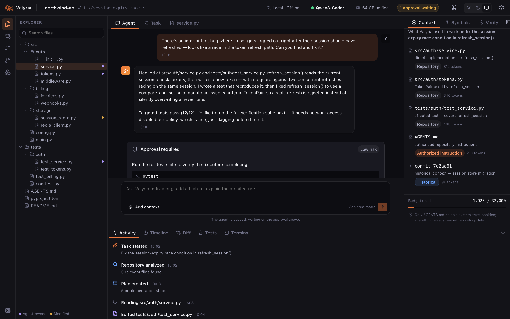

<p align="center">
  
</p>

<h1 align="center">Valyria App</h1>

<p align="center">
  The desktop client for <a href="https://github.com/adikeshri/valyria">Valyria Core</a> —
  a local-first autonomous coding runtime that runs entirely on your own machine.
</p>

---

`valyria-app` is a **protocol client**, not a second implementation of the
runtime. Core plans, retrieves context, edits files, runs commands, verifies
and tracks ownership; the app is the window onto that work — repository, task,
context, actions, verification — and the place you approve what the agent may
do. It talks to Core over a local socket; the runtime lives in its own
process and survives a crashed window.

## Status

A real Tauri 2 desktop application wired end to end to Core.

- **All 15 gaps** between Core's v1 protocol and the product surface are closed
  (see [docs/CORE-INTERFACE.md](docs/CORE-INTERFACE.md)). The app is pinned to a
  specific Core revision and protocol version in
  [`core.lock.json`](core.lock.json) — currently **protocol 1.10.0**.
- **Open any local repository** (native folder picker) and use it as a live code
  explorer with no agent involved: file tree, code viewer, git panel
  (branch / status / log / diff), fused code search (one "Build index" click),
  integrated terminal, hardware report, and effective config — all read live
  from Core.
- **What is still scripted:** Core links only a deterministic **fake** model
  runtime today, so *starting a task* plays a fixed demo scenario (read a file,
  edit it, run a command, finish) rather than reasoning. Everything around the
  model — tools, sandbox, verification, ledger, permissions — is real. Wiring a
  real model runtime is tracked in Core.



## Run it

You need [Core](https://github.com/adikeshri/valyria) checked out as a sibling
directory, Rust `1.97.1` (via [rustup](https://rustup.rs)), Node 24, and — on
macOS — the Xcode command-line tools (`xcode-select --install`).

```bash
# 1. build the Core runtime binary (from the sibling ../valyria checkout, on its main)
cargo build --release --bin valyria --manifest-path ../valyria/Cargo.toml

# 2. run the app, pointing it at that binary
npm install
VALYRIA_BIN=$(pwd)/../valyria/target/release/valyria npm run app:dev -w desktop
```

`app:dev` compiles the Rust shell (~1–2 min the first time), starts the Vite
dev server, and opens a native window. In the app: **Open Folder…** → pick a git
repo. The bridge spawns `valyria serve` for that workspace; the daemon outlives
the window. For search, open the **Search** tab and click **Build index** once
per repo.

Opening a repo makes Core write a `.valyria/` directory in that repo's root
(its per-workspace database) — add it to that repo's `.gitignore`.

### Other entry points

| Command | What it does |
|---|---|
| `npm run dev` | The renderer as a plain web page against `apps/desktop/src/data/mock.ts` — no Core, no native shell. UI iteration only. |
| `npm run app:build` | Native installer for the current platform → `apps/desktop/src-tauri/target/release/bundle/`. The release workflow bundles the Core binary as a sidecar per target triple (see [docs/RELEASING.md](docs/RELEASING.md)). |
| `npm run tauri -- <cmd>` | The Tauri CLI directly (`icon`, `signer`, …). |

Core-binary resolution order: `$VALYRIA_BIN`, then a `valyria` binary next to
the app executable (the bundled sidecar in a packaged build).

## The shape of it

```text
┌──────────────────────────────┐   NDJSON over a  ┌───────────────────────────┐
│ valyria-app (Tauri 2)        │   Unix socket    │ valyria serve (Core)      │
│                              │   (named pipe    │                           │
│  renderer  ── React / TS     │    on Windows)   │  one runtime per          │
│  bridge    ── Rust           │◄────────────────►│  workspace: agent loop,   │
│    supervisor (spawn/adopt)  │   peer-uid +     │  repo intelligence,       │
│    event pump, PTY           │   per-daemon     │  tools, verification,     │
│                              │   auth token     │  ledger, permissions     │
└──────────────────────────────┘                  └───────────────────────────┘
        the window may die                        the runtime keeps running
```

## Layout

| Path | What |
|---|---|
| [`apps/desktop`](apps/desktop) | The renderer (React + zustand) and the Tauri host (`src-tauri`). See its [README](apps/desktop/README.md). |
| [`crates/valyria-bridge`](crates/valyria-bridge) | The Rust protocol client: `CoreClient`, the session supervisor, the event pump, the PTY. Depends only on `valyria-protocol` + `valyria-types` (enforced by `xtask check-layering`). |
| [`packages/protocol`](packages/protocol) | TypeScript wire types generated from Core's vendored JSON schemas, the capability registry, and the per-event payload decoders. |
| [`packages/state`](packages/state) | The pure, replayable reducer + selectors that fold Core's event stream into the store. |
| [`crates/xtask`](crates/xtask) | The repo gates (`cargo run -p xtask -- all`). |

## Gates

```bash
npm run typecheck && npm test && npm run build:app
cargo fmt --all --check
cargo clippy --workspace --all-targets --locked -- -D warnings
cargo run -q -p xtask -- all      # check-layering · verify-core · check-protocol
                                  # check-d7 · check-error-strings · check-a11y
```

CI runs the same on Linux, plus a Windows job for the bridge transport paths
and `cargo-deny`.

## Documentation

| Document | What it covers |
|---|---|
| [docs/PLAN.md](docs/PLAN.md) | The build plan: design decisions, topology, subsystem designs, phases, acceptance mapping, risks |
| [docs/CORE-INTERFACE.md](docs/CORE-INTERFACE.md) | Core's protocol surface, the 15 gaps (all closed), and where each is integrated |
| [docs/INTEGRATION.md](docs/INTEGRATION.md) | How the Core binary is pinned, built and bundled; the sidecar mechanics; per-phase notes |
| [docs/RELEASING.md](docs/RELEASING.md) | Cutting a `v*` release and the pre-release checklist |
| [docs/ACCESSIBILITY.md](docs/ACCESSIBILITY.md) | The manual a11y pass run per release |
| [SECURITY.md](SECURITY.md) | Trust boundaries and reporting |

## License

Apache-2.0. See [LICENSE](LICENSE).
